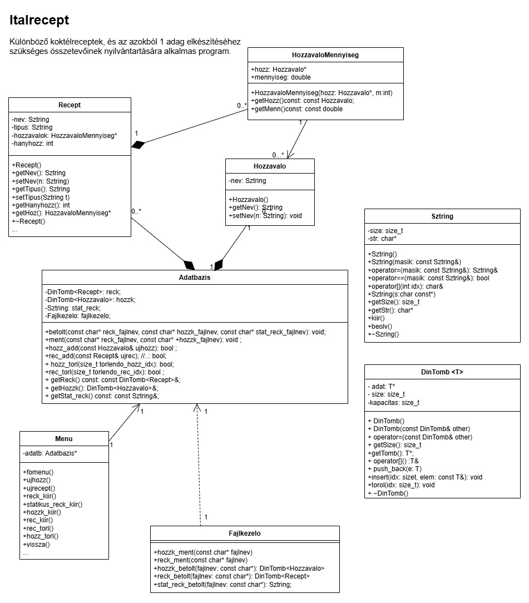

# Drink Recipe Manager

A console-based object-oriented C++ application designed to manage drink recipes from ingredients. This project was developed as a comprehensive academic assignment to demonstrate manual memory management, custom data structures, and advanced OOP principles.

  

## About the Project

Modern C++ projects usually rely heavily on the Standard Template Library, but this project was intentionally built without the use of STL, to prove a deep understanding of how memory and pointers work.

## Technical Features

* **Data Structures:** Implementation of a custom dynamic array (`DinTomb`) and a custom string class (`Sztring`).
* **Memory Management:** Manual usage of raw pointers and dynamic memory allocation.
* **Leak Detection:** Integrated with a custom memory trace header (`memtrace.h`) to guarantee a 100% memory-leak-free execution.
* **File I/O Operations:** Persistent storage and retrieval of recipes and ingredients from text files (`hozzavalok.txt`, `receptek.txt`).
* **Exception Handling:** Robust error handling implemented in `kivetelek.hpp`.
* **MVC-like Structure:** Clean separation of database handling (`Adatbazis`), business logic (`Recept`, `Hozzavalo`), and user interaction (`Menu`).

## Repository Structure

* `src/` - All C++ source files (`.cpp`) and headers (`.hpp`).
* `data/` - The text files used for persistent database storage.
* `docs/` - The detailed (Hungarian) documentation and project specifications.
* `assets/` - Images and visual resources.

## Getting Started

To compile and run the project locally using a standard C++ compiler (like g++):

1. Clone the repository.
3. Compile the source files:
`g++ tesztelosmain.cpp Adatbazis.cpp Fajlkezelo.cpp Hozzavalo_m.cpp Menu.cpp Recept.cpp Sztring.cpp memtrace.cpp -o tesztelosmain.exe`
4. Run the executable:
`./src/tesztelosmain.exe`
